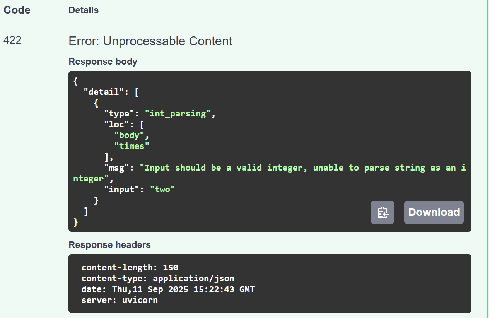

# Конспекты по обучению

## Первый день, конспект

### Отчёт День 1
**Чтение**  
- Безопасный метод - тот метод, который не вносит каких-либо изменений в объект, а лишь получает из него информацию

- Идемпотентный метод - тот, который при многократном применении будет давать один результат

- PATCH отличается от PUT тем, что PATCH отправляет инструкции, указывающие на то, как нужно изменить существующий объект, а PUT отправляет совершенно новый объект на замену старому

- Коды допустимые для POST и PATCH  
 PATCH
200 - OK
204 - No Content
202 - Accepted
400, 404, 409, 500, 501
412, 415, 422,  
 POST 
200 - OK
201 - Crated 
202 - Accepted
204 - No Content
400, 401, 403,
404, 409,415,
422, 500

**Практика**  
- pytest вывод: 1 passed in 0.26s
- 
- Вопросы: Я сдела всё пошагово, но лично мне непонятно почти ничего из того, что я сделал. Возможно из-за тогоб что это вообще первый опыт в этом

### Отчёт День 2
**Чтение** 
- request body - json файл, отправляемый клиентом на сервер, который сервер затем обрабатывает, валидирует, гибко меняет типы (строки на числа, например), указывается прием request body файлов через библиотеку pydantic и создания скелета request body. Работает с методами, которые что-то отправляют, но может работать и с GET в каких-то исключительных кейсах

- HTTP запрос состоит из 5 частей (или 4-х):
    - Метод запроса (GET, POST, PUT, PATCH и т.д.)
    - Строка запроса (Путь к ресурсу, параметры для сервера)
    - Версия протокола 
    - Заголовок (Дополнительная информация в форме строк имя: значение)
    - Тело запроса (информация отправленная на сервер клиентом, не всегда есть в запросе, так как не все запросы что-либо отправляют, например, get и options)

**Практика**
- pytest вывод: 3 passed in 0.40s
- 